# Tahap Pengerjaan Shopy

Breakdown detail tahap pengerjaan aplikasi Shopy, dari setup awal sampai rilis. Untuk gambaran umum fitur & tech stack, lihat [README.md](./README.md).

## Fase 0 — Persiapan

- [x] Setup monorepo: `git init` di root, dengan subfolder `shopy-mobile` (Flutter) dan `shopy-api` (.NET Core) — tanpa `.git` terpisah di masing-masing subfolder
- [x] Setup PostgreSQL database (local & environment dev)
- [x] Desain skema database awal (users, products, categories, cart, orders)
  - Ketentuan umum: semua tabel pakai soft delete (kolom `IsDeleted bool`, default `false`) — bukan hard delete
  - [x] Table `Users` (extend `AspNetUsers` dari Identity): `FullName`, `AvatarUrl`, `CreatedAt`, `IsDeleted`
  - [x] Table `Addresses` (1 user bisa banyak alamat): `Id`, `UserId` (FK), `Label`, `RecipientName`, `PhoneNumber`, `FullAddress`, `City`, `Province`, `PostalCode`, `IsDefault`, `CreatedAt`, `IsDeleted`
  - [x] Table `Categories` (hierarchical/subkategori): `Id`, `Name`, `Slug`, `ParentCategoryId` (FK self-reference, nullable), `ImageUrl`, `CreatedAt`, `IsDeleted`
  - [x] Table `Products`: `Id`, `CategoryId` (FK), `Name`, `Slug`, `Description`, `Price`, `Stock`, `ImageUrl` (1 gambar), `RatingAverage`, `RatingCount` (denormalized dari `Reviews`), `IsActive`, `CreatedAt`, `UpdatedAt`, `IsDeleted`
  - [x] Table `Reviews`: `Id`, `ProductId` (FK), `UserId` (FK), `Rating` (1-5), `Comment`, `CreatedAt`, `IsDeleted`
  - [x] Table `Carts` (support guest cart): `Id`, `UserId` (FK, nullable untuk guest), `GuestId` (nullable, identifier cart guest), `CreatedAt`, `UpdatedAt`, `IsDeleted`
  - [x] Table `CartItems`: `Id`, `CartId` (FK), `ProductId` (FK), `Quantity`, `CreatedAt`, `UpdatedAt`, `IsDeleted`
  - [x] Table `Orders`: `Id`, `OrderNumber` (unique), `UserId` (FK), `AddressId` (FK), `Status` (enum: Pending/Processing/Shipped/Completed/Cancelled), `TotalAmount`, snapshot alamat pengiriman (`RecipientName`, `PhoneNumber`, `FullAddress`, `City`, `Province`, `PostalCode` — disalin dari `Addresses` saat checkout), `CreatedAt`, `UpdatedAt`, `IsDeleted`
  - [x] Table `OrderItems`: `Id`, `OrderId` (FK), `ProductId` (FK), `ProductNameSnapshot`, `UnitPrice` (snapshot harga saat order), `Quantity`, `Subtotal`, `IsDeleted`
  - [x] Setup EF Core migration awal & apply ke database dev
- [x] Setup design system dasar: warna (oranye `#FF6B35` sebagai primary), tipografi, spacing
  - [x] `AppColors` — primary `#FF6B35`, Material 3 `ColorScheme`, warna semantik (success/warning/error)
  - [x] `AppTypography` — text theme Poppins (Google Fonts) di seluruh skala Material 3
  - [x] `AppSpacing` — skala 4/8/16/24/32/48
  - [x] `AppTheme` digabung jadi `ThemeData` & di-wire ke `MaterialApp`
- [x] Finalisasi logo & assets (sudah selesai — `assets/logo.svg`)

## Fase 1 — Autentikasi

- [x] Backend: setup ASP.NET Core Identity
- [x] Backend: endpoint register & login
- [x] Backend: generate JWT (access token) + refresh token
- [x] Backend: middleware validasi token
- [x] Backend: integrasi login sosial (Google & Facebook OAuth)
  - Endpoint `POST /api/auth/external/google` (verifikasi ID token) & `POST /api/auth/external/facebook` (verifikasi access token via Graph API) sudah jadi & teruji dengan token palsu (401) dan config kosong (503)
  - ⚠️ **Belum bisa dites dengan token asli** — butuh Google OAuth Client ID & Facebook App ID/Secret yang harus dibuat manual oleh kamu (lihat penjelasan di chat), lalu diisi ke `appsettings.Development.json` → `Authentication:Google:ClientId` & `Authentication:Facebook:AppId`/`AppSecret`
- [x] Backend: endpoint lupa password (request reset & verifikasi kode)
  - `POST /api/auth/forgot-password`, `/verify-reset-code`, `/reset-password` — OTP 6 digit, expired 10 menit, hashed di DB, sudah teruji end-to-end (termasuk reuse code ditolak, email tidak terdaftar tidak bocor)
  - ⚠️ **Pengiriman email masih pakai kredensial Gmail SMTP placeholder** — isi `appsettings.Development.json` → `Email:Username` (alamat Gmail) & `Email:Password` (App Password, bukan password akun biasa — perlu aktifkan 2FA dulu di akun Google lalu generate di myaccount.google.com/apppasswords). Selama placeholder kosong, OTP hanya tercatat di server log (mode dev), tidak benar-benar terkirim ke email.
- [x] Flutter: halaman Login & Register (UI) — desain terpilih: **Wave Header**, termasuk tombol login via Google & Facebook

  

  - `screens/auth/login_screen.dart` & `register_screen.dart`, reusable `widgets/auth/{wave_header,auth_text_field,social_login_button}.dart`
  - Register nambah field Nomor HP (sesuai mockup) → backend `RegisterRequest.PhoneNumber` disesuaikan
  - ⚠️ Tombol Google/Facebook baru UI saja (nampilin pesan "belum dikonfigurasi") — integrasi SDK native (`google_sign_in`/`flutter_facebook_auth` + config Android/iOS) belum dikerjakan, karena butuh kredensial OAuth asli yang belum ada (lihat catatan di item Backend login sosial di atas)
- [x] Flutter: halaman Lupa Password (UI) — alur: input email → verifikasi kode OTP → buat password baru

  

  - `forgot_password_screen.dart` → `verify_code_screen.dart` (OTP 6 digit + countdown resend 59 detik) → `reset_password_screen.dart`
- [x] Flutter: provider (Riverpod) untuk auth state — `providers/auth_provider.dart` (`AuthNotifier`: login/register/logout/bootstrap)
- [x] Flutter: simpan token dengan `flutter_secure_storage` — `services/token_storage_service.dart`
- [x] Flutter: auto refresh token saat expired — interceptor Dio di `services/api_client.dart` (401 → refresh sekali → retry request asli, dengan lock supaya tidak dobel-refresh kalau ada beberapa request 401 bersamaan)
- [x] Flutter: halaman Splash/cek status login — desain terpilih: **Pulse Rings**, pakai logo asli (`assets/logo.svg`)

  

  - `screens/splash/splash_screen.dart` — animasi pulse ring + cek sesi tersimpan, lalu arahkan ke Login atau Home placeholder (Home asli baru dibuat Fase 2)

## Fase 2 — Katalog Produk

- [x] Backend: model & endpoint kategori produk
  - Model `Category` sudah ada dari Fase 0. Endpoint baru: `GET /api/categories` (kategori root), `GET /api/categories/{slug}` (detail + child categories) — `Controllers/CategoriesController.cs`
- [x] Backend: model & endpoint produk (list, detail, search, filter)
  - Model `Product` sudah ada dari Fase 0. Endpoint baru: `GET /api/products` (paged, filter `categoryId`/`categorySlug` — termasuk produk dari subkategori, `minPrice`/`maxPrice`, search `q`, sort `Newest`/`PriceAsc`/`PriceDesc`/`RatingDesc`), `GET /api/products/{slug}` (detail) — `Controllers/ProductsController.cs`, DTO di `Models/Catalog/CatalogDtos.cs`
  - Data contoh (dev-only, auto-seed sekali kalau tabel Categories kosong): `Data/CatalogSeeder.cs` — 8 kategori (4 root + 4 sub), 12 produk. Berguna buat testing & pengembangan Flutter Home nanti.
  - Sudah dites manual end-to-end lewat `dotnet run` + `curl`: list, filter kategori (termasuk turunan), search, filter harga, sort, detail, 404.
- [x] Flutter: halaman Home (listing produk, kategori) — desain terpilih: **Bold & Colorful**

  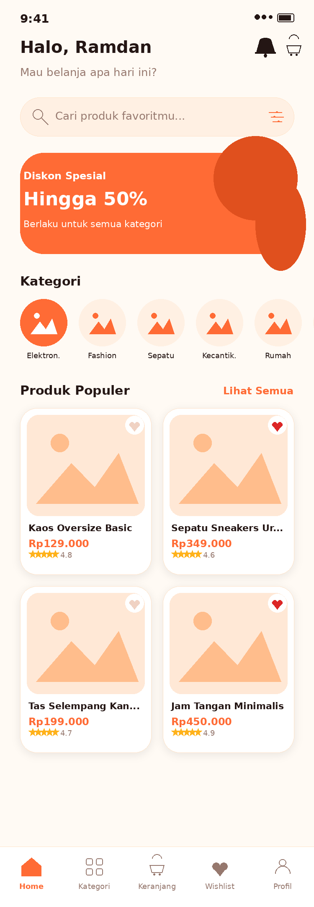

  `screens/home/home_screen.dart` sudah jadi halaman asli: sapaan + tombol logout/keranjang, search bar (buka halaman Search & Filter), banner promo statis, baris kategori (dari `GET /api/categories`, tap kategori → Search & Filter dengan filter kategori terisi), dan grid "Produk Populer" (dari `GET /api/products?sort=RatingDesc`) — tiap kartu produk (`widgets/products/product_card.dart`) sudah pakai `WishlistToggleButton` & `AppBottomNav` yang sama seperti Fase 3.
  - ⚠️ Mockup juga menampilkan harga coret/diskon di kartu produk — dilewati karena `Product` di backend belum punya field diskon.
- [x] Flutter: halaman Detail Produk — desain terpilih: **Bold & Colorful**

  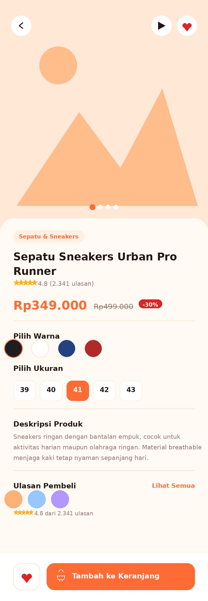

  `screens/products/product_detail_screen.dart` — fetch `GET /api/products/{slug}`, tampilkan gambar (placeholder), kategori, nama, rating, harga, deskripsi, ringkasan rating, tombol wishlist, dan "Tambah ke Keranjang".
  - ⚠️ Mockup juga menampilkan pilihan warna/ukuran, harga coret, dan daftar ulasan pembeli per-orang — dilewati karena `Product` di backend belum punya data varian/diskon, dan belum ada endpoint ulasan produk (cuma `RatingAverage`/`RatingCount` agregat yang tersedia).
- [x] Flutter: fitur pencarian & filter produk — desain terpilih: **Bold & Colorful**

  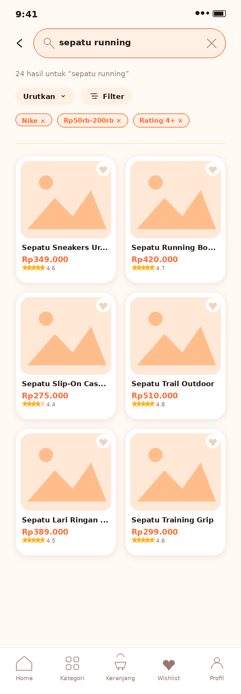

  `screens/products/product_search_screen.dart` — search bar, sort (`Urutkan`: Terbaru/Harga Terendah/Harga Tertinggi/Rating Tertinggi), filter rentang harga (bottom sheet), chip filter aktif (kategori/harga, bisa dihapus), grid hasil + "Muat Lebih Banyak" (paginasi).
  - ⚠️ Mockup juga menampilkan filter brand ("Nike") & rating minimum sebagai chip — dilewati karena backend belum punya field brand dan tidak ada parameter filter rating minimum (hanya sort `RatingDesc`).
- [x] Flutter: provider untuk state produk (Riverpod)

  `providers/catalog_provider.dart` — `homeCategoriesProvider`/`popularProductsProvider` (`FutureProvider`, auto-retry Riverpod dimatikan karena UI sudah punya tombol "Coba lagi" manual), `productDetailProvider` (`FutureProvider.family` by slug), dan `productSearchProvider` (`NotifierProvider` dengan `ProductSearchState` di `providers/catalog_search_state.dart` — query, kategori, harga, sort, paginasi). Model di `models/catalog/` (`Category`, `ProductSummary`, `ProductDetail`, `PagedResult`, `ProductSort`), service HTTP di `services/catalog_api_service.dart`.
  - 🐛 Sekalian ketemu & diperbaiki bug lama: `services/api_client.dart` hardcode base URL ke port `5199`, padahal backend (`launchSettings.json`) jalan di port `5083` — jadi selama ini Flutter gak pernah benar-benar bisa connect ke backend lokal (auth sekalipun). Sudah diperbaiki ke `5083`.
  - Diuji: `flutter analyze` bersih, `flutter test` lulus (termasuk `test/home_screen_test.dart` baru). Endpoint `/api/categories` & `/api/products` juga sudah dicek langsung lewat `curl` ke backend yang jalan (`dotnet run`, setelah role/database Postgres lokal `shopy`/`shopy_dev` dibuat & migration di-apply) dan bentuk JSON-nya cocok sama model Dart.
  - ⚠️ **Belum sempat dites visual di browser/device asli** — percobaan screenshot otomatis (Playwright headless) gagal karena WebGL tidak tersedia di environment headless ini (`CONTEXT_LOST_WEBGL`), jadi Flutter web (CanvasKit) gak bisa render apa-apa di situ. Coba jalanin manual (`flutter run -d chrome` atau `-d windows`) buat verifikasi visual terakhir sebelum dianggap benar-benar kelar.

## Fase 3 — Keranjang & Wishlist

- [x] Backend: endpoint cart (add, update qty, remove, get)
  - `Controllers/CartController.cs` (`api/cart`, `[Authorize]`, satu cart per user — dibuat otomatis kalau belum ada): `GET /api/cart`, `POST /api/cart/items` (`{productId, quantity}` — nambah qty kalau produk sudah ada, clamp ke stok), `PUT /api/cart/items/{itemId}` (`{quantity}`), `DELETE /api/cart/items/{itemId}`, `DELETE /api/cart` (kosongkan semua). DTO di `Models/Carts/CartDtos.cs`.
  - Sudah dites end-to-end lewat `dotnet run` + `curl`: get cart kosong, add, add lagi ke produk sama (qty nambah), update qty, remove item, 401 tanpa token.
- [x] Backend: endpoint wishlist
  - Table baru `WishlistItems` (`Models/WishlistItem.cs` + migration `AddWishlistItems`) — belum ada dari Fase 0, jadi ditambah sekarang: `UserId`+`ProductId` (unique per user, soft delete). `Controllers/WishlistController.cs` (`api/wishlist`, `[Authorize]`): `GET /api/wishlist`, `POST /api/wishlist` (`{productId}`, idempotent), `DELETE /api/wishlist/{productId}`. DTO di `Models/Wishlists/WishlistDtos.cs`.
  - Sudah dites end-to-end lewat `curl`: get kosong, add, get terisi, delete, get kosong lagi.
  - 🐛 Nemu bug lama sekalian pas nyiapin database buat ngetes: local Postgres di komputer ini belum ada role `shopy`/database `shopy_dev` sama sekali (padahal `appsettings.Development.json` udah nunjuk ke situ dari Fase 0) — dibuatkan & migration di-apply.
- [x] Flutter: halaman Keranjang — desain terpilih: **Bold & Colorful**

  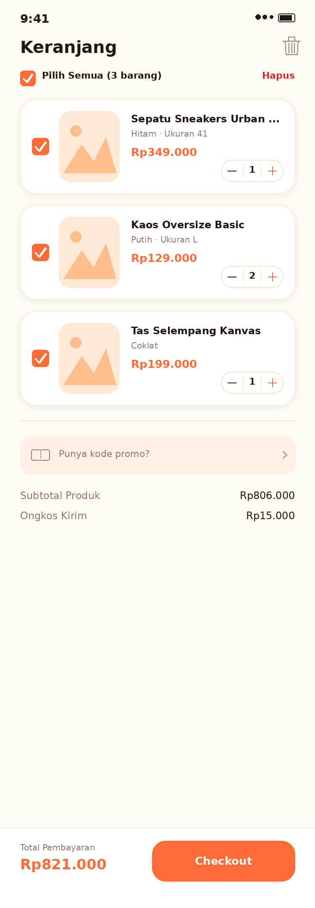

  `screens/cart/cart_screen.dart` + widget pendukung di `widgets/cart/` (`cart_item_card`, `promo_code_section`, `cart_checkout_bar`, `delete_confirm_sheet`, `checkout_summary_sheet`, `empty_cart_view`). Semua state di mockup sudah jadi: terisi, kosong, promo/voucher (kode demo `HEMAT20`, masih lokal — belum ada endpoint promo), swipe-to-delete (`Dismissible` + bottom sheet konfirmasi), hapus semua/hapus barang terpilih, dan ringkasan checkout sebagai bottom sheet. Ditambah loading spinner & state gagal+"Coba lagi" pas fetch dari API.
  - ⚠️ Tombol "Lanjut ke Checkout" di ringkasan cuma nampilin SnackBar placeholder, karena halaman Checkout (Fase 4) belum dikerjakan.
- [x] Flutter: cartProvider (Riverpod) — sinkron dengan navbar/icon cart & backend

  `providers/cart_provider.dart` (`CartNotifier` + `cartItemCountProvider`) sekarang fetch/mutasi lewat `services/cart_api_service.dart` (`GET/POST/PUT/DELETE /api/cart...`) alih-alih data in-memory. State pilih ("selected") buat checkout tetap murni lokal (tidak ada di backend) — dipertahankan lewat merge tiap kali data terbaru datang dari server. Badge jumlah barang di `widgets/shared/app_bottom_nav.dart` otomatis ikut berubah di halaman mana pun (Home/Keranjang/Wishlist) karena semua baca dari provider yang sama.
- [x] Flutter: fitur wishlist/favorit di halaman produk — desain terpilih: **Bold & Colorful**

  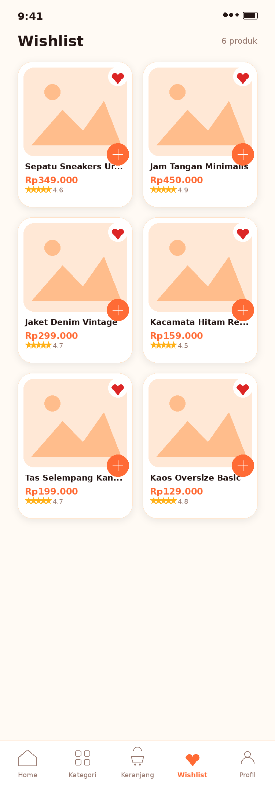

  Halaman Wishlist: `screens/wishlist/wishlist_screen.dart` + `providers/wishlist_provider.dart` (`WishlistNotifier`, sekarang sambung ke `services/wishlist_api_service.dart`), mencakup semua state mockup (grid, list, mode pilih untuk bulk hapus/pindah ke keranjang, kosong, loading, gagal+"Coba lagi"). `widgets/wishlist/wishlist_toggle_button.dart` (tombol hati reusable) sudah ditempel di kartu produk Home/Search (`widgets/products/product_card.dart`) & halaman Detail Produk sejak Fase 2 Flutter.

## Fase 4 — Checkout & Pesanan

- [x] Backend: endpoint checkout (buat order dari cart)
  - 🐛 Prasyarat yang ternyata belum ada dari Fase 0: endpoint CRUD alamat. Ditambah `Controllers/AddressesController.cs` (`api/addresses`, `[Authorize]`): `GET`, `POST`, `PUT/{id}`, `DELETE/{id}`, `PATCH/{id}/default` (set alamat utama, otomatis unset yang lama; alamat pertama user otomatis jadi default). DTO di `Models/Addresses/AddressDtos.cs`.
  - `Controllers/OrdersController.cs` → `POST /api/orders` (`{addressId, cartItemIds[], note?}`): validasi alamat & stok, hitung subtotal + ongkir flat (`Rp15.000`, sama seperti simulasi Flutter — belum ada integrasi kurir asli), snapshot alamat & harga produk ke `Order`/`OrderItem`, generate nomor pesanan (`SHP-yyyyMMdd-XXXX`), catat `OrderStatusHistory` awal (`Pending`), dan hapus (soft-delete) cart item yang di-checkout — cart item yang tidak dicentang tetap ada. Cuma barang yang dicentang di halaman Keranjang yang ikut checkout.
  - Nambah `Order.Note` & `Order.ShippingCost`, plus tabel baru `OrderStatusHistories` (migration `AddAddressesCheckoutOrders`) buat timeline lacak pesanan.
  - 🐛 Sekalian ketemu bug: enum di JSON request body (`UpdateOrderStatusRequest.Status`) gak bisa di-parse dari string ("Processing") karena System.Text.Json defaultnya cuma terima angka. Ditambahin `JsonStringEnumConverter` global di `Program.cs`.
- [x] Backend: endpoint riwayat & detail pesanan
  - `GET /api/orders?status=&page=&pageSize=` (paged, filter status opsional) & `GET /api/orders/{id}` (detail lengkap: item, alamat, breakdown harga, timeline status) — DTO di `Models/Orders/OrderDtos.cs`.
- [x] Backend: manajemen status pesanan (pending, diproses, dikirim, selesai)
  - `PATCH /api/orders/{id}/status` — update status + catat `OrderStatusHistory`.
  - ⚠️ App ini belum punya role seller/admin terpisah (cuma ada 1 jenis user), jadi endpoint ini masih dibatasi ke pesanan milik user itu sendiri saja (bukan dibuka ke "role" lain yang idealnya mengelola status). Karena itu juga endpoint ini sengaja **belum disambungkan ke UI Flutter manapun** — pesanan yang baru dibuat lewat app akan diam di status `Pending` ("Menunggu Konfirmasi", cuma muncul di tab "Semua") karena tidak ada alur otomatis yang memprosesnya. Sudah dites lewat `curl`: update status, filter riwayat by status, cegah update ke status yang sama.
  - Sudah dites end-to-end lewat `curl`: alamat → cart → checkout → cart ke-kosongin → riwayat pesanan → detail pesanan → update status → filter riwayat.
- [x] Flutter: halaman Checkout (alamat, ringkasan, konfirmasi) — desain terpilih: **Bold & Colorful**

  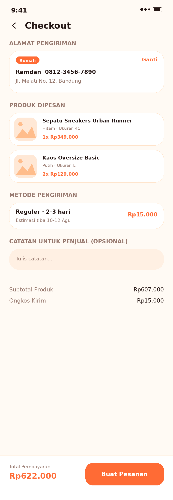

  `screens/checkout/checkout_screen.dart` (alamat + ringkasan produk terpilih dari Keranjang + metode pengiriman statis + catatan opsional + total) dan `checkout_success_screen.dart` (state sukses, nomor pesanan, tombol "Lihat Pesanan"). Bottom sheet pilih/tambah alamat di `widgets/checkout/address_picker_sheet.dart` & `widgets/address/address_form_sheet.dart`, provider di `providers/address_provider.dart`.
  - Tombol "Lanjut ke Checkout" di ringkasan Keranjang (Fase 3) sekarang benar-benar buka halaman ini.
  - ⚠️ Tombol "Lanjut ke Pembayaran" di halaman sukses cuma placeholder, karena Fase 5 (Payment Gateway) belum dikerjakan — pesanan yang dibuat otomatis nyangkut di status "Menunggu Konfirmasi" (lihat catatan manajemen status di atas).
- [x] Flutter: halaman Riwayat Transaksi — desain terpilih: **Bold & Colorful**

  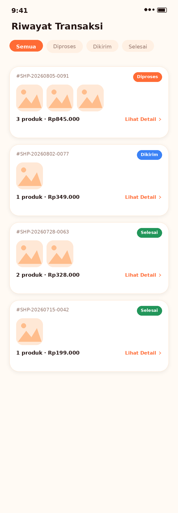

  `screens/orders/order_history_screen.dart` — tab filter status (Semua/Diproses/Dikirim/Selesai), state kosong, loading, gagal+"Coba lagi", paginasi "Muat Lebih Banyak". Provider: `providers/order_provider.dart` (`orderHistoryProvider`).
  - ⚠️ Belum ada halaman Profil (di luar scope TASKS.md sejauh ini), jadi tab **Profil** di bottom nav sementara diarahkan ke halaman ini juga — konten akun paling relevan yang sudah ada. Tab Kategori tetap "belum tersedia".
- [x] Flutter: halaman Detail Pesanan + tracking status — desain terpilih: **Bold & Colorful**

  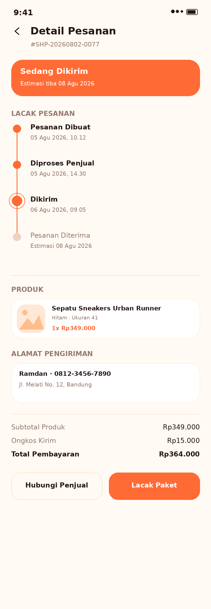

  `screens/orders/order_detail_screen.dart` — banner status, timeline "Lacak Pesanan" (4 langkah, diisi dari `OrderStatusHistory` asli, langkah yang belum tercapai ditandai "Menunggu"), daftar produk, alamat, catatan, breakdown harga. Provider: `orderDetailProvider` (`FutureProvider.family` by id).
  - ⚠️ Tombol "Hubungi Penjual" & "Lacak Paket" masih placeholder (belum ada fitur chat penjual maupun integrasi kurir asli).

## Fase 5 — Payment Gateway

- [x] Riset & pilih payment gateway (Midtrans/Xendit, dll)
  - Pilih **Midtrans**, pakai **Core API** (bukan Snap) supaya UI pembayaran tetap custom sesuai mockup Bold & Colorful, bukan halaman/webview bawaan Midtrans.
  - Metode yang diimplementasikan: **Transfer Bank BCA & BNI** (VA), **GoPay**, **QRIS**. Mockup juga menampilkan Transfer Mandiri, OVO, dan DANA — sengaja tidak dibuat karena butuh endpoint/alur Midtrans Core API yang beda (Mandiri pakai `echannel` bukan `bank_transfer`, OVO butuh linking nomor HP, DANA tidak tersedia langsung) — lihat catatan di `Models/PaymentMethod.cs`.
- [x] Backend: integrasi API payment gateway
  - `Services/MidtransService.cs` (`IMidtransService`) — charge (VA/GoPay/QRIS lewat `POST /v2/charge`), cek status (`GET /v2/{order_id}/status`), verifikasi signature (SHA512). Pola konfigurasi sama seperti Google/Facebook OAuth: `Midtrans:ServerKey` kosong → endpoint balas `503 Service Unavailable` alih-alih error asal.
  - `Controllers/PaymentsController.cs`: `POST /api/orders/{orderId}/payments` (charge — idempotent, pakai transaksi pending yang sama kalau belum expired), `GET /api/orders/{orderId}/payments/latest`, `POST /api/orders/{orderId}/payments/latest/refresh` (cek manual ke Midtrans — ini yang jadi tombol "Cek Status Pembayaran" di mockup).
  - Table baru `Payments` (migration `AddPayments`) — simpan metode, status, nomor VA/QR, waktu expired, snapshot jumlah tagihan.
  - Begitu pembayaran `Settled`, `Order.Status` otomatis maju dari `Pending` → `Processing` (dicatat di `OrderStatusHistory`) — ini jadi pemicu asli transisi status pesanan yang di Fase 4 masih "nyangkut", karena app belum punya role seller/admin.
  - ⚠️ **Belum dites dengan Server Key sandbox asli** — sudah dicek endpoint balas `503` dengan benar kalau `Midtrans:ServerKey` kosong (perilaku sama seperti Fase 1), tapi charge/status/webhook beneran ke Midtrans baru bisa diverifikasi begitu kamu isi `appsettings.Development.json` → `Midtrans:ServerKey` (ambil dari dashboard.midtrans.com sandbox → Settings → Access Keys).
- [x] Backend: webhook konfirmasi pembayaran
  - `POST /api/payments/webhook` (`[AllowAnonymous]`, diverifikasi lewat `signature_key` SHA512 — bukan bearer token, karena Midtrans yang manggil langsung, bukan lewat app).
  - ⚠️ Webhook asli dari Midtrans **tidak bisa menjangkau backend yang jalan di `localhost`** tanpa tunnel publik (mis. ngrok) — belum di-setup di environment dev ini. Karena itu endpoint "Cek Status Pembayaran" manual (`.../payments/latest/refresh`, dipanggil dari tombol yang memang sudah ada di mockup) jadi jalur utama yang bisa dites & dipakai di lokal; endpoint webhook tetap dibuat lengkap & siap pakai kalau nanti di-deploy ke server dengan URL publik.
- [x] Flutter: halaman pembayaran & konfirmasi — desain terpilih: **Bold & Colorful**

  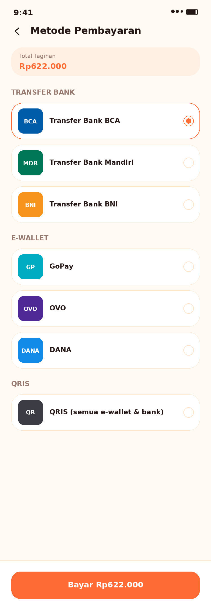

  `screens/payment/payment_method_screen.dart` (pilih metode, total tagihan), `payment_instruction_screen.dart` (nomor VA + tombol salin, atau QR untuk GoPay/QRIS, countdown mundur ke waktu expired, tombol "Cek Status Pembayaran"), `payment_success_screen.dart` (konfirmasi berhasil). Tombol "Lanjut ke Pembayaran" di halaman sukses Checkout (Fase 4) sekarang beneran ke sini.

## Fase 6 — Notifikasi

- [x] Setup push notification (Firebase Cloud Messaging)
  - Backend: `Services/PushNotificationService.cs` (`IPushNotificationService`) pakai Firebase Admin SDK (NuGet `FirebaseAdmin`), baca service account key dari `Firebase:ServiceAccountKeyPath`. Pola sama seperti OAuth/Midtrans: kalau belum dikonfigurasi, `IsConfigured` = false dan kirim push jadi no-op (notifikasi in-app di database tetap kesimpan, cuma push-nya yang dilewati).
  - Flutter: `firebase_core` + `firebase_messaging` ditambah ke `pubspec.yaml`. `services/push_notification_service.dart` — minta izin notifikasi, ambil & daftarkan FCM token ke backend (`POST /api/device-tokens`), dengerin pesan foreground.
  - ⚠️ **`lib/firebase_options.dart` masih placeholder** (nilai `REPLACE_ME`) — belum ada project Firebase asli. Begitu kamu jalanin `flutterfire configure` di folder `shopy-mobile`, file ini otomatis ketimpa konfigurasi asli. Sebelum itu, `Firebase.initializeApp()` gagal dengan aman (ditangkap di `PushNotificationService.initialize()`) dan app tetap jalan normal tanpa push. Server Key Firebase Admin SDK (`Firebase:ServiceAccountKeyPath` di `appsettings.Development.json`) juga masih kosong — filenya (`shopy-api/firebase-service-account.json`, sudah di-gitignore) perlu kamu taruh sendiri dari Firebase Console → Project Settings → Service accounts.
- [x] Backend: trigger notifikasi (promo, status pesanan)
  - Table baru `Notifications` (riwayat in-app) & `DeviceTokens` (migration `AddNotifications`). `Services/NotificationService.cs` (`INotificationService`): `NotifyOrderStatusChangedAsync` (dipanggil otomatis dari `OrdersController.UpdateStatus` & `PaymentsController` saat pembayaran settled memicu Pending→Processing) dan `BroadcastPromoAsync`.
  - `Controllers/NotificationsController.cs`: `GET /api/notifications` (paged), `GET /api/notifications/unread-count`, `PATCH /api/notifications/{id}/read`, `POST /api/notifications/read-all`, `POST /api/notifications/promo` (broadcast). `Controllers/DeviceTokensController.cs`: daftar/hapus token.
  - ⚠️ Sama seperti update status pesanan di Fase 4: belum ada role admin/seller, jadi `POST /api/notifications/promo` masih terbuka buat user manapun yang login — bukan endpoint publik/admin sungguhan.
  - Sudah dites end-to-end lewat `curl`: daftar device token, trigger notifikasi otomatis dari ubah status pesanan, tandai dibaca, unread count, broadcast promo ke semua user.
- [x] Flutter: handle notifikasi (foreground & background) — desain terpilih: **Bold & Colorful**

  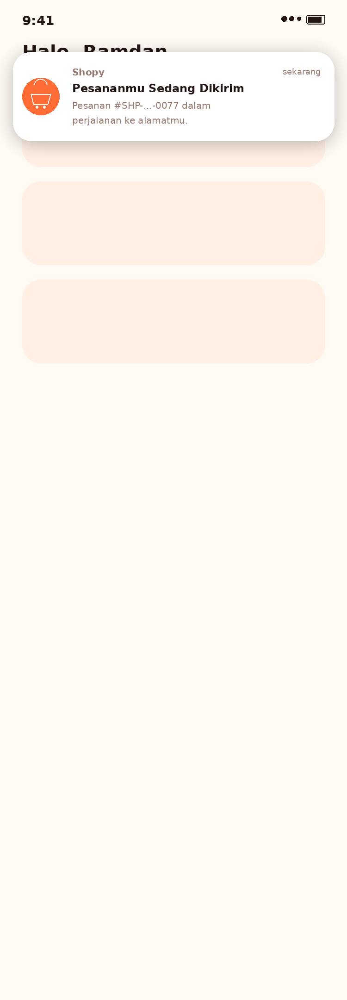

  `widgets/notification/in_app_notification_banner.dart` + `notification_banner_host.dart` (membungkus seluruh app lewat `MaterialApp.builder` di `main.dart`, dengerin `PushNotificationService.onForegroundMessage`, auto-dismiss 5 detik) untuk notifikasi foreground. Notifikasi background/terminated ditangani otomatis oleh FCM (nampilin system tray dari payload `notification` yang dikirim backend) + `firebaseMessagingBackgroundHandler` top-level function. Halaman Riwayat Notifikasi juga sudah jadi (list dikelompokkan Hari Ini/Kemarin/tanggal, penanda belum dibaca, state kosong):

  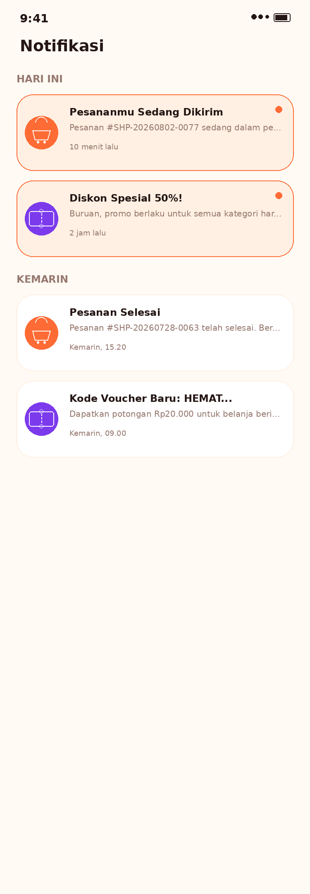

  `screens/notifications/notification_history_screen.dart`, provider `providers/notification_provider.dart` (`notificationHistoryProvider`, `unreadNotificationCountProvider`). Ikon lonceng + badge unread count sudah ditempel di header Home, buka halaman ini.
  - ⚠️ **Belum dites dengan push asli** — sama seperti Midtrans, perlu Firebase project & service account key kamu isi dulu (lihat catatan "Setup push notification" di atas) sebelum bisa diverifikasi live end-to-end.

## Fase 7 — Polish & Testing

- [ ] Review & rapikan UI/UX di semua halaman
- [ ] Unit test (backend & Flutter)
- [ ] Widget/integration test (Flutter)
- [ ] Testing manual end-to-end (dari register sampai checkout)
- [ ] Perbaikan bug hasil testing

## Fase 8 — Rilis

- [ ] Setup app icon & splash screen final
- [ ] Build release (Android APK/AAB, iOS jika perlu)
- [ ] Deploy backend ke server/hosting
- [ ] Submit ke Play Store (dan App Store jika ada)
- [ ] Dokumentasi akhir & update README

---

**Cara pakai file ini:** centang `[ ]` jadi `[x]` setiap task selesai. Update fase secara berurutan, tapi boleh disesuaikan kalau ada prioritas yang berubah.
