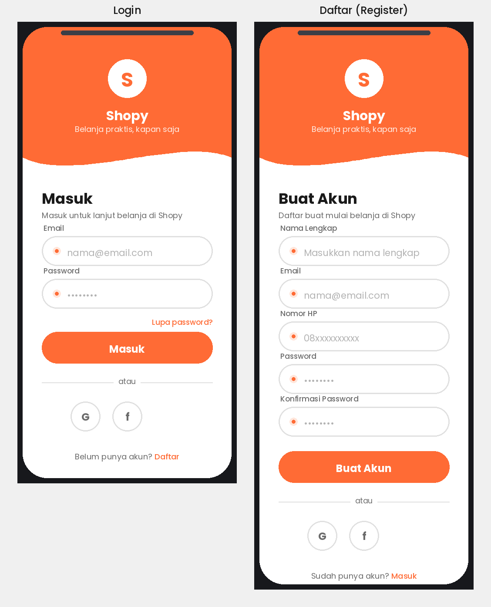
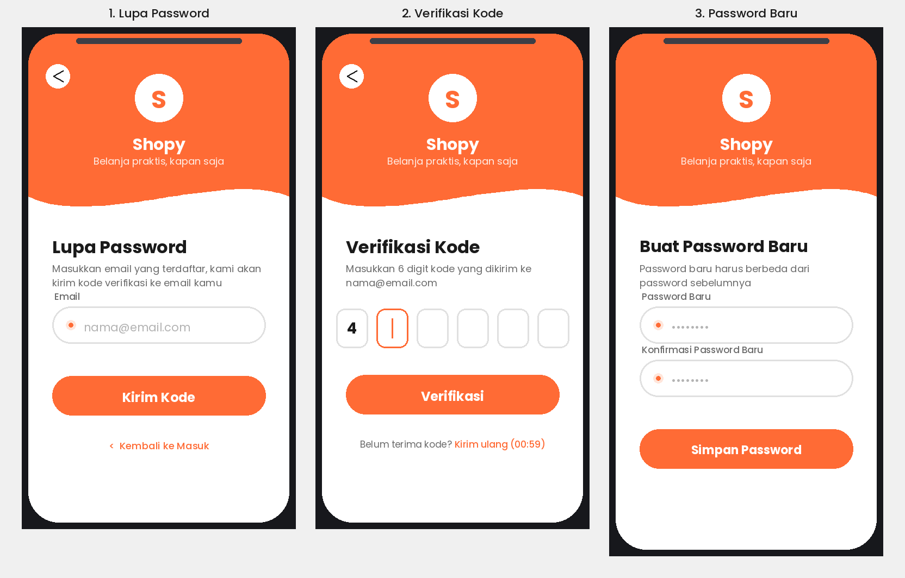
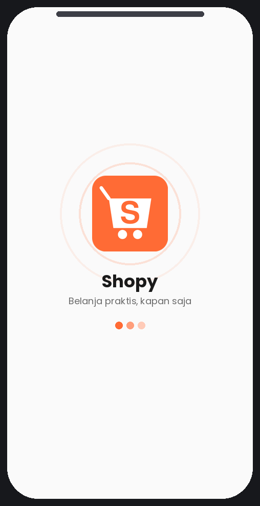

# Tahap Pengerjaan Shopy

Breakdown detail tahap pengerjaan aplikasi Shopy, dari setup awal sampai rilis. Untuk gambaran umum fitur & tech stack, lihat [README.md](./README.md).

## Fase 0 — Persiapan

- [x] Setup monorepo: `git init` di root, dengan subfolder `shopy-mobile` (Flutter) dan `shopy-api` (.NET Core) — tanpa `.git` terpisah di masing-masing subfolder
- [x] Setup PostgreSQL database (local & environment dev)
- [x] Desain skema database awal (users, products, categories, cart, orders)
  - Ketentuan umum: semua tabel pakai soft delete (kolom `IsDeleted bool`, default `false`) — bukan hard delete
  - [x] Table `Users` (extend `AspNetUsers` dari Identity): `FullName`, `AvatarUrl`, `CreatedAt`, `IsDeleted`
  - [x] Table `Addresses` (1 user bisa banyak alamat): `Id`, `UserId` (FK), `Label`, `RecipientName`, `PhoneNumber`, `FullAddress`, `City`, `Province`, `PostalCode`, `IsDefault`, `CreatedAt`, `IsDeleted`
  - [x] Table `Categories` (hierarchical/subkategori): `Id`, `Name`, `Slug`, `ParentCategoryId` (FK self-reference, nullable), `ImageUrl`, `CreatedAt`, `IsDeleted`
  - [x] Table `Products`: `Id`, `CategoryId` (FK), `Name`, `Slug`, `Description`, `Price`, `Stock`, `ImageUrl` (1 gambar), `RatingAverage`, `RatingCount` (denormalized dari `Reviews`), `IsActive`, `CreatedAt`, `UpdatedAt`, `IsDeleted`
  - [x] Table `Reviews`: `Id`, `ProductId` (FK), `UserId` (FK), `Rating` (1-5), `Comment`, `CreatedAt`, `IsDeleted`
  - [x] Table `Carts` (support guest cart): `Id`, `UserId` (FK, nullable untuk guest), `GuestId` (nullable, identifier cart guest), `CreatedAt`, `UpdatedAt`, `IsDeleted`
  - [x] Table `CartItems`: `Id`, `CartId` (FK), `ProductId` (FK), `Quantity`, `CreatedAt`, `UpdatedAt`, `IsDeleted`
  - [x] Table `Orders`: `Id`, `OrderNumber` (unique), `UserId` (FK), `AddressId` (FK), `Status` (enum: Pending/Processing/Shipped/Completed/Cancelled), `TotalAmount`, snapshot alamat pengiriman (`RecipientName`, `PhoneNumber`, `FullAddress`, `City`, `Province`, `PostalCode` — disalin dari `Addresses` saat checkout), `CreatedAt`, `UpdatedAt`, `IsDeleted`
  - [x] Table `OrderItems`: `Id`, `OrderId` (FK), `ProductId` (FK), `ProductNameSnapshot`, `UnitPrice` (snapshot harga saat order), `Quantity`, `Subtotal`, `IsDeleted`
  - [x] Setup EF Core migration awal & apply ke database dev
- [x] Setup design system dasar: warna (oranye `#FF6B35` sebagai primary), tipografi, spacing
  - [x] `AppColors` — primary `#FF6B35`, Material 3 `ColorScheme`, warna semantik (success/warning/error)
  - [x] `AppTypography` — text theme Poppins (Google Fonts) di seluruh skala Material 3
  - [x] `AppSpacing` — skala 4/8/16/24/32/48
  - [x] `AppTheme` digabung jadi `ThemeData` & di-wire ke `MaterialApp`
- [x] Finalisasi logo & assets (sudah selesai — `assets/logo.svg`)

## Fase 1 — Autentikasi

- [x] Backend: setup ASP.NET Core Identity
- [x] Backend: endpoint register & login
- [x] Backend: generate JWT (access token) + refresh token
- [x] Backend: middleware validasi token
- [x] Backend: integrasi login sosial (Google & Facebook OAuth)
  - Endpoint `POST /api/auth/external/google` (verifikasi ID token) & `POST /api/auth/external/facebook` (verifikasi access token via Graph API) sudah jadi & teruji dengan token palsu (401) dan config kosong (503)
  - ⚠️ **Belum bisa dites dengan token asli** — butuh Google OAuth Client ID & Facebook App ID/Secret yang harus dibuat manual oleh kamu (lihat penjelasan di chat), lalu diisi ke `appsettings.Development.json` → `Authentication:Google:ClientId` & `Authentication:Facebook:AppId`/`AppSecret`
- [x] Backend: endpoint lupa password (request reset & verifikasi kode)
  - `POST /api/auth/forgot-password`, `/verify-reset-code`, `/reset-password` — OTP 6 digit, expired 10 menit, hashed di DB, sudah teruji end-to-end (termasuk reuse code ditolak, email tidak terdaftar tidak bocor)
  - ⚠️ **Pengiriman email masih pakai kredensial Gmail SMTP placeholder** — isi `appsettings.Development.json` → `Email:Username` (alamat Gmail) & `Email:Password` (App Password, bukan password akun biasa — perlu aktifkan 2FA dulu di akun Google lalu generate di myaccount.google.com/apppasswords). Selama placeholder kosong, OTP hanya tercatat di server log (mode dev), tidak benar-benar terkirim ke email.
- [ ] Flutter: halaman Login & Register (UI) — desain terpilih: **Wave Header**, termasuk tombol login via Google & Facebook

  

- [ ] Flutter: halaman Lupa Password (UI) — alur: input email → verifikasi kode OTP → buat password baru

  

- [ ] Flutter: provider (Riverpod) untuk auth state
- [ ] Flutter: simpan token dengan `flutter_secure_storage`
- [ ] Flutter: auto refresh token saat expired
- [ ] Flutter: halaman Splash/cek status login — desain terpilih: **Pulse Rings**, pakai logo asli (`assets/logo.svg`)

  

## Fase 2 — Katalog Produk

- [ ] Backend: model & endpoint kategori produk
- [ ] Backend: model & endpoint produk (list, detail, search, filter)
- [ ] Flutter: halaman Home (listing produk, kategori)
- [ ] Flutter: halaman Detail Produk
- [ ] Flutter: fitur pencarian & filter produk
- [ ] Flutter: provider untuk state produk (Riverpod)

## Fase 3 — Keranjang & Wishlist

- [ ] Backend: endpoint cart (add, update qty, remove, get)
- [ ] Backend: endpoint wishlist
- [ ] Flutter: halaman Keranjang
- [ ] Flutter: cartProvider (Riverpod) — sinkron dengan navbar/icon cart
- [ ] Flutter: fitur wishlist/favorit di halaman produk

## Fase 4 — Checkout & Pesanan

- [ ] Backend: endpoint checkout (buat order dari cart)
- [ ] Backend: endpoint riwayat & detail pesanan
- [ ] Backend: manajemen status pesanan (pending, diproses, dikirim, selesai)
- [ ] Flutter: halaman Checkout (alamat, ringkasan, konfirmasi)
- [ ] Flutter: halaman Riwayat Transaksi
- [ ] Flutter: halaman Detail Pesanan + tracking status

## Fase 5 — Payment Gateway

- [ ] Riset & pilih payment gateway (Midtrans/Xendit, dll)
- [ ] Backend: integrasi API payment gateway
- [ ] Backend: webhook konfirmasi pembayaran
- [ ] Flutter: halaman pembayaran & konfirmasi

## Fase 6 — Notifikasi

- [ ] Setup push notification (Firebase Cloud Messaging)
- [ ] Backend: trigger notifikasi (promo, status pesanan)
- [ ] Flutter: handle notifikasi (foreground & background)

## Fase 7 — Polish & Testing

- [ ] Review & rapikan UI/UX di semua halaman
- [ ] Unit test (backend & Flutter)
- [ ] Widget/integration test (Flutter)
- [ ] Testing manual end-to-end (dari register sampai checkout)
- [ ] Perbaikan bug hasil testing

## Fase 8 — Rilis

- [ ] Setup app icon & splash screen final
- [ ] Build release (Android APK/AAB, iOS jika perlu)
- [ ] Deploy backend ke server/hosting
- [ ] Submit ke Play Store (dan App Store jika ada)
- [ ] Dokumentasi akhir & update README

---

**Cara pakai file ini:** centang `[ ]` jadi `[x]` setiap task selesai. Update fase secara berurutan, tapi boleh disesuaikan kalau ada prioritas yang berubah.
