# Tahap Pengerjaan Shopy Seller

Breakdown detail tahap pengerjaan **sisi penjual (seller)** aplikasi Shopy. Dokumen ini melanjutkan [TASKS.md](./TASKS.md) (sisi pembeli, Fase 0-6 sudah selesai) dan memakai gaya penulisan yang sama: centang `[ ]` jadi `[x]` setiap task selesai.

**Keputusan arsitektur yang sudah diambil:**

- **App terpisah** — folder baru `shopy-seller/` di monorepo yang sama (bukan mode di dalam app pembeli).
- **Order dipecah per toko** — 1 checkout bisa menghasilkan beberapa **SubOrder**, tiap toko hanya mengelola sub-order miliknya.
- **Cakupan penuh** — toko & produk & pesanan, keuangan & pencairan, promo & voucher, chat & ulasan.

---

## Kondisi Saat Ini (hasil audit kode)

Yang **sudah ada** dan bisa dipakai ulang: ASP.NET Core Identity + JWT + refresh token, `Categories`, `Products`, `Carts`, `Orders`/`OrderItems`/`OrderStatusHistories`, `Payments` (Midtrans Core API), `Notifications` + `DeviceTokens` (FCM), `Reviews` (tabel saja), design system Flutter (`AppColors`/`AppTypography`/`AppSpacing`/`AppTheme`), pola `ApiClient` + Riverpod + `flutter_secure_storage`.

Yang **belum ada sama sekali** dan jadi pekerjaan utama dokumen ini:

| # | Gap | Dampak |
|---|-----|--------|
| 1 | Tidak ada entitas **toko/seller**. `Product` tidak punya `StoreId`, `Order` tidak tahu produk itu milik siapa | Fondasi seluruh fitur seller |
| 2 | **Role belum dipakai**. `AddRoles<IdentityRole<Guid>>()` sudah didaftarkan di `Program.cs`, tapi tidak ada role yang di-seed dan `TokenService` **tidak menyisipkan claim role sama sekali** | Semua endpoint seller butuh ini |
| 3 | Tidak ada endpoint **CRUD produk** (hanya `GET`), dan `Product.ImageUrl` cuma 1 gambar berupa string | Manajemen produk |
| 4 | Tidak ada infrastruktur **upload file** | Logo toko, foto produk, bukti kirim, dokumen verifikasi |
| 5 | `PATCH /api/orders/{id}/status` masih dibatasi ke pesanan milik user sendiri (lihat catatan TASKS.md Fase 4) | Harus dipindah ke sisi seller |
| 6 | **Stok tidak pernah dikurangi** saat checkout — `OrdersController.Checkout` hanya memvalidasi `Quantity > Stock` 🐛 | Wajib diperbaiki di Fase 4 |
| 7 | Tidak ada **Reviews controller** (tabelnya ada, endpoint-nya tidak) | Ulasan & balasan penjual |
| 8 | Tidak ada **chat** dan tidak ada infrastruktur realtime | Chat pembeli-penjual |
| 9 | Tidak ada **saldo/komisi/pencairan** | Keuangan seller |
| 10 | Voucher/diskon masih **hardcoded di Flutter** (`kMockPromoCode = 'HEMAT20'` di `providers/cart_provider.dart`), `Product` tidak punya field diskon | Promo & voucher |
| 11 | `POST /api/notifications/promo` **terbuka untuk user manapun yang login** | Harus dikunci ke role Admin |
| 12 | Ongkir masih flat `Rp15.000` (`FlatShippingCost` di `OrdersController` & `kMockShippingCost` di Flutter) | Ongkir per kurir/berat |

> ⚠️ **Breaking change:** menambah `Product.StoreId` (wajib) dan memecah `Orders` jadi `SubOrders` akan mengubah tabel & DTO yang sudah dipakai app pembeli. Rencanakan migrasi data seeder (`Data/CatalogSeeder.cs`, 12 produk) ke satu "toko demo" sebelum menjalankan migration.

---

## Fase 0 — Persiapan & Skema Data

- [x] Buat app Flutter baru `shopy-seller` di root monorepo (`flutter create`), **tanpa `.git` terpisah** — konsisten dengan `shopy-mobile`/`shopy-api`
  - `flutter create --org com.shopy --project-name shopy_seller .` dijalankan di folder `shopy-seller/` yang sudah ada (isi `design/` mockup tetap aman). Bundle ID `com.shopy.shopySeller` (beda dari `com.shopy.shopyMobile`) supaya bisa ter-install berdampingan di HP yang sama.
- [x] Salin/ekstrak design system dari `shopy-mobile/lib/theme/` (`AppColors`, `AppTypography`, `AppSpacing`, `AppTheme`) — opsi: jadikan package lokal `packages/shopy_ui` supaya tidak dobel maintain
  - Dipilih **copy-paste langsung** (bukan package lokal) — konsisten dengan pola project ini (belum pernah ada shared package di monorepo). 4 file disalin apa adanya ke `shopy-seller/lib/theme/`.
- [x] Salin pola infrastruktur dari `shopy-mobile`: `services/api_client.dart` (interceptor auto-refresh token), `services/token_storage_service.dart`, struktur `providers/` + `models/` + `screens/` + `widgets/`
  - `api_client.dart`, `token_storage_service.dart`, dan `models/auth/auth_response.dart` disalin apa adanya (login pakai endpoint sama persis, lihat Fase 1). Folder `providers/`, `models/`, `screens/`, `widgets/` dibuat kosong, diisi mulai Fase 1.
- [x] Tambah dependency: `flutter_riverpod`, `dio`, `flutter_secure_storage`, `google_fonts`, `flutter_svg`, `image_picker`, `firebase_core`, `firebase_messaging`, `fl_chart` (grafik statistik)
  - Versi disamakan dengan `shopy-mobile` untuk yang sudah ada; `image_picker`/`fl_chart` baru (belum pernah dipakai di `shopy-mobile`). `flutter analyze` & `flutter test` (smoke test) lulus.
- [x] Desain skema database seller — ketentuan umum tetap sama: **semua tabel pakai soft delete** (`IsDeleted bool`, default `false`)
  - [x] Table `Stores`: `Id`, `OwnerUserId` (FK `AspNetUsers`, unique — 1 user = 1 toko), `Name`, `Slug` (unique), `Description`, `LogoUrl`, `BannerUrl`, `PhoneNumber`, `Status` (enum: `Pending`/`Active`/`Suspended`/`Closed`), `IsOpen` (buka/tutup toko), `RatingAverage`, `RatingCount`, `ProductCount`, `FollowerCount`, `CreatedAt`, `UpdatedAt`, `IsDeleted`
  - [x] Table `StoreAddresses` (alamat pickup / asal pengiriman): `Id`, `StoreId` (FK), `Label`, `PicName`, `PhoneNumber`, `FullAddress`, `City`, `Province`, `PostalCode`, `IsDefault`, `IsDeleted`
  - [x] Table `StoreDocuments` (verifikasi toko): `Id`, `StoreId` (FK), `Type` (enum: `Ktp`/`Npwp`/`Nib`), `FileUrl`, `Status` (`Pending`/`Approved`/`Rejected`), `RejectReason`, `ReviewedAt`, `IsDeleted`
  - [x] Ubah `Products`: tambah `StoreId` (FK **wajib**), `Weight` (gram), `Condition` (enum `New`/`Used`), `SoldCount`, `ViewCount`, `DiscountPrice` (nullable), `DiscountStartAt`/`DiscountEndAt`
  - [x] Table `ProductImages`: `Id`, `ProductId` (FK), `Url`, `SortOrder`, `IsPrimary`, `IsDeleted` — menggantikan `Product.ImageUrl` tunggal (kolom lama dipertahankan dulu sebagai cache gambar utama supaya app pembeli tidak langsung rusak)
  - [x] Table `SubOrders`: `Id`, `OrderId` (FK), `StoreId` (FK), `SubOrderNumber` (unique, mis. `SHP-20260810-0142-1`), `Status` (enum: `WaitingPayment`/`NewOrder`/`Processing`/`Shipped`/`Completed`/`Cancelled`/`Rejected`), `Subtotal`, `ShippingCost`, `VoucherDiscount`, `CommissionAmount`, `SellerEarning`, `CourierCode`, `CourierService`, `TrackingNumber`, `ShippedAt`, `CompletedAt`, `AutoCancelAt`, `CancelReason`, `CreatedAt`, `UpdatedAt`, `IsDeleted`
  - [x] Ubah `OrderItems`: tambah `SubOrderId` (FK) — item tetap tergantung ke `Order` untuk kompatibilitas, tapi dikelompokkan per sub-order
    - ⚠️ Dibuat **nullable**, bukan wajib — logic checkout yang benar-benar mengelompokkan per toko baru dikerjakan di Fase 4 (refactor checkout).
  - [x] Table `SubOrderStatusHistories` (pengganti/pendamping `OrderStatusHistories`): `Id`, `SubOrderId`, `Status`, `Note`, `ChangedByUserId`, `ChangedAt`
  - [x] `Orders.Status` jadi **status agregat** hasil turunan sub-order (mis. semua sub-order `Completed` → order `Completed`)
    - Tidak ada perubahan skema untuk ini — murni catatan perilaku buat logic Fase 4.
  - [x] Table `StoreBalances`: `StoreId` (PK/FK), `AvailableBalance`, `PendingBalance`, `TotalEarning`, `UpdatedAt`
  - [x] Table `BalanceTransactions` (mutasi saldo): `Id`, `StoreId` (FK), `Type` (enum: `SaleIncome`/`Commission`/`Withdrawal`/`WithdrawalFee`/`Refund`/`Adjustment`), `Amount` (signed), `BalanceAfter`, `SubOrderId` (nullable), `WithdrawalId` (nullable), `Description`, `CreatedAt`
  - [x] Table `BankAccounts`: `Id`, `StoreId` (FK), `BankCode`, `BankName`, `AccountNumber`, `AccountHolderName`, `IsVerified`, `IsDefault`, `IsDeleted`
  - [x] Table `Withdrawals`: `Id`, `StoreId` (FK), `BankAccountId` (FK), `Amount`, `AdminFee`, `NetAmount`, `Status` (`Pending`/`Processing`/`Completed`/`Rejected`), `RejectReason`, `RequestedAt`, `ProcessedAt`, `IsDeleted`
  - [x] Table `Vouchers` (voucher toko): `Id`, `StoreId` (FK), `Code`, `Type` (enum: `Percentage`/`FixedAmount`/`FreeShipping`), `Value`, `MaxDiscount`, `MinPurchase`, `Quota`, `UsedCount`, `StartAt`, `EndAt`, `IsActive`, `IsDeleted` — unique `(StoreId, Code)`
  - [x] Table `VoucherUsages`: `Id`, `VoucherId` (FK), `UserId` (FK), `SubOrderId` (FK), `DiscountAmount`, `UsedAt`
  - [x] Table `FlashSales` + `FlashSaleItems` (opsional, untuk tab Flash Sale): periode, produk, harga khusus, kuota — **disertakan sekarang** (bukan ditunda)
  - [x] Table `ChatRooms`: `Id`, `StoreId` (FK), `BuyerUserId` (FK), `LastMessageAt`, `LastMessagePreview`, `UnreadCountSeller`, `UnreadCountBuyer`, `CreatedAt`, `IsDeleted` — unique `(StoreId, BuyerUserId)`
  - [x] Table `ChatMessages`: `Id`, `ChatRoomId` (FK), `SenderType` (enum `Buyer`/`Seller`), `SenderUserId`, `Body`, `AttachmentUrl`, `ProductId` (nullable), `SubOrderId` (nullable), `ReadAt`, `CreatedAt`, `IsDeleted`
  - [x] Ubah `Reviews`: tambah `StoreId`, `SubOrderId`, `SellerReply`, `SellerRepliedAt`, `ImageUrls` (atau tabel `ReviewImages`)
    - Dipilih 1 kolom `ImageUrls` (JSON array string), bukan tabel `ReviewImages` terpisah — belum dipakai sampai `ReviewsController` dibuat di Fase 7.
  - [x] Table `StoreFollowers` (opsional, untuk angka "Pengikut" di profil toko): `Id`, `StoreId`, `UserId`, `CreatedAt` — **disertakan sekarang** (bukan ditunda)
- [x] Migrasi data lama: buat 1 "toko demo" lalu assign semua produk seeder (`Data/CatalogSeeder.cs`) ke toko itu, dan generate `SubOrders` untuk `Orders` yang sudah ada — **jalankan sebelum** `StoreId` dijadikan non-nullable
  - `CatalogSeeder.cs` diperluas: bikin akun `seller-demo@shopy.com` (password `SellerDemo1234!`, dev-only) + toko "Toko Demo Shopy", semua 12 produk seeder di-assign ke situ — tapi karena seeder ini cuma jalan sekali (guard `Categories` kosong) dan sudah pernah jalan di sesi sebelumnya, jalur ini belum benar-benar tereksekusi di DB dev sekarang.
  - Yang benar-benar jalan: migration `AddSellerFoundation` sendiri punya backfill raw-SQL 2 lapis (idempotent) — (1) 12 produk lama yang sudah ada di-assign ke toko fallback "Toko Migrasi" (dibuatkan akun + toko dummy otomatis), (2) 1 `Order` lama (`SHP-20260807-8349`) dikelompokkan jadi `SubOrder` per toko dari produknya. Sudah diverifikasi lewat psql: 0 produk tersisa dengan `StoreId` kosong, 0 `OrderItems` tanpa `SubOrderId`.
- [x] Setup EF Core migration & apply ke database dev (`shopy`/`shopy_dev`)
  - Migration `AddSellerFoundation` — perlu diketahui: DB dev asli project ini ternyata **Postgres native Windows** (`localhost:5432`), BUKAN container `shopy-postgres` di `docker-compose.yml` (yang ada & jalan tapi kosong/tidak dipakai — cek dengan `psql` native, bukan `docker exec`, kalau mau verifikasi data).
- [x] Konfigurasi baru di `appsettings.json`: `Platform:CommissionPercent` (mis. 2%), `Platform:WithdrawalAdminFee` (mis. Rp2.500), `Platform:MinWithdrawal`, `Platform:AutoCancelHours` (mis. 24 jam), `Platform:AutoCompleteDays` (mis. 3 hari setelah `Shipped`)
  - Ditambahkan ke `appsettings.json` & `appsettings.Development.json`: `CommissionPercent=2`, `WithdrawalAdminFee=2500`, `MinWithdrawal=50000`, `AutoCancelHours=24`, `AutoCompleteDays=3`. Belum dibaca oleh kode manapun (baru dipakai mulai Fase 4/5).
- ⚠️ **Regresi app pembeli sudah dicek** — `dotnet build` 0 error, `/api/products`, `/api/categories`, login `test@shopy.com`, dan `/api/orders` semua masih 200 dengan bentuk response sama seperti sebelumnya.

## Fase 1 — Auth & Role Seller

- [ ] Backend: seed role `Buyer` / `Seller` / `Admin` lewat `RoleManager` saat startup (pola sama seperti `CatalogSeeder`)
- [ ] Backend: `TokenService.GenerateAccessToken` menyisipkan claim `role` (dari `UserManager.GetRolesAsync`) + claim `store_id` kalau user punya toko aktif — **saat ini claim yang dikirim cuma `sub`, `email`, `jti`, `full_name`**
- [ ] Backend: helper `ClaimsPrincipalExtensions.GetStoreId()` + attribute `[Authorize(Roles = "Seller")]` di semua controller seller, dan guard "toko harus `Active`"
- [ ] Backend: `POST /api/seller/store` (buka toko — user yang sudah login mengajukan toko, status awal `Pending`), `GET /api/seller/store/status` (status verifikasi)
- [ ] Backend: `GET /api/seller/me` — profil user + ringkasan toko (untuk bootstrap app seller)
- [ ] Backend: login pakai endpoint yang sama (`POST /api/auth/login`), tapi app seller menolak user tanpa role `Seller` dengan pesan jelas ("Akun ini belum punya toko")
- [ ] Flutter: Splash + cek sesi (reuse pola `splash_screen.dart` dari app pembeli, desain **Pulse Rings**)
- [ ] Flutter: halaman Login & Register seller — reuse desain **Wave Header** dari app pembeli
- [ ] Flutter: halaman **Buka Toko** (3 langkah: Data Toko → Alamat → Verifikasi) + halaman status "Menunggu Verifikasi"

  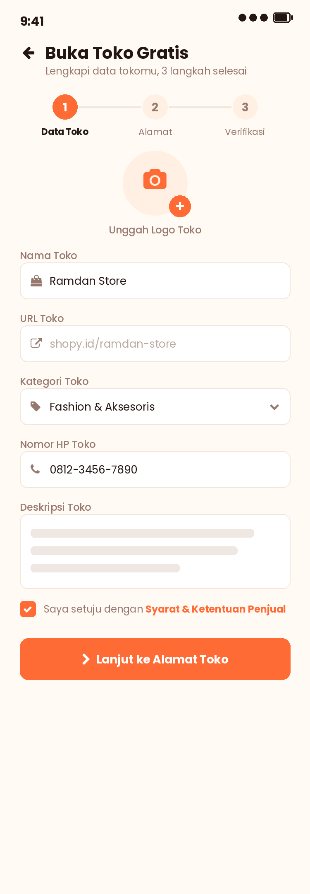

- [ ] Flutter: `authProvider` + `storeProvider` (Riverpod), token disimpan di `flutter_secure_storage`
- ⚠️ Catatan yang diwariskan dari TASKS.md Fase 1: login Google/Facebook masih butuh kredensial OAuth asli, dan pengiriman email OTP masih pakai placeholder Gmail SMTP. Sisi seller ikut kena batasan yang sama.

## Fase 2 — Profil & Pengaturan Toko

- [ ] Backend: **infrastruktur upload file** `POST /api/uploads` (validasi tipe & ukuran, simpan ke `wwwroot/uploads` untuk dev + abstraksi `IFileStorage` supaya gampang pindah ke S3/Cloudinary saat deploy) — ini prasyarat logo toko, foto produk, bukti kirim, dan dokumen verifikasi
- [ ] Backend: `GET /api/seller/store`, `PUT /api/seller/store` (nama, deskripsi, logo, banner, kontak), `PATCH /api/seller/store/open` (buka/tutup toko)
- [ ] Backend: CRUD `StoreAddresses` (alamat pickup) `GET/POST/PUT/DELETE /api/seller/store/addresses` + set default
- [ ] Backend: CRUD `BankAccounts` `GET/POST/DELETE /api/seller/bank-accounts` + set default
- [ ] Backend: upload `StoreDocuments` untuk verifikasi + endpoint admin approve/reject (lihat Fase 9)
- [ ] Backend (publik): `GET /api/stores/{slug}` (profil toko untuk app pembeli) + `GET /api/stores/{slug}/products`
- [ ] Flutter: halaman **Profil & Pengaturan Toko** (statistik ringkas, toggle buka/tutup toko, menu ke semua submenu, keluar akun)

  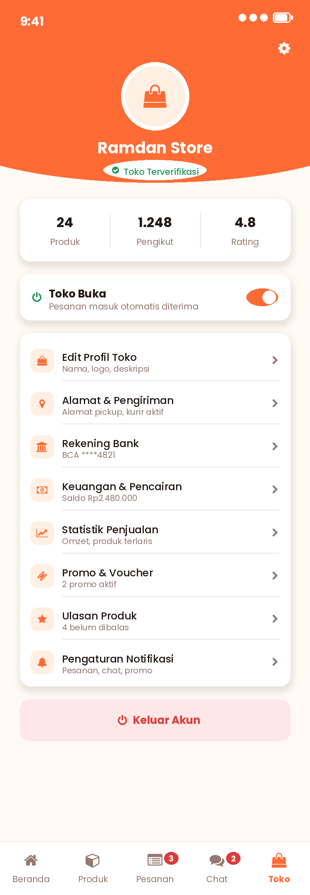

- [ ] Flutter: halaman Edit Profil Toko, Alamat & Pengiriman, Rekening Bank
- ⚠️ Perubahan di app pembeli (`shopy-mobile`): halaman Detail Produk perlu menampilkan kartu info toko + tombol "Kunjungi Toko", dan perlu halaman Profil Toko publik.

## Fase 3 — Manajemen Produk

- [ ] Backend: `GET /api/seller/products` (paged, filter `status`=aktif/nonaktif/habis, search, sort) — hanya produk milik toko yang login
- [ ] Backend: `POST /api/seller/products` (nama, kategori, harga, stok, berat, kondisi, deskripsi, gambar[], status tayang) + slug auto-generate & dijamin unik
- [ ] Backend: `PUT /api/seller/products/{id}`, `DELETE /api/seller/products/{id}` (soft delete), `PATCH /api/seller/products/{id}/active` (toggle tayang)
- [ ] Backend: `PATCH /api/seller/products/bulk` — update stok & harga banyak produk sekaligus
- [ ] Backend: `GET /api/seller/products/low-stock` (ambang batas bisa diatur, dipakai dashboard & notifikasi)
- [ ] Backend: tambahkan `storeId`/`storeName` ke DTO produk publik (`Models/Catalog/CatalogDtos.cs`) supaya app pembeli bisa menampilkan asal toko
- [ ] Flutter: halaman **Daftar Produk** (tab Semua/Aktif/Nonaktif/Habis, toggle tayang, badge stok menipis, aksi ubah/hapus, FAB tambah produk)

  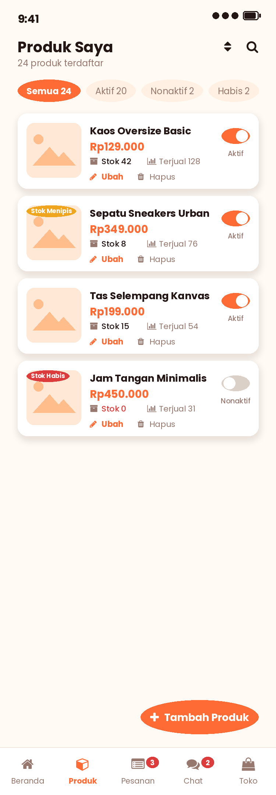

- [ ] Flutter: halaman **Tambah/Edit Produk** (multi-foto + foto utama, kategori, harga, stok stepper, berat, deskripsi, kondisi, toggle tayang, simpan draf)

  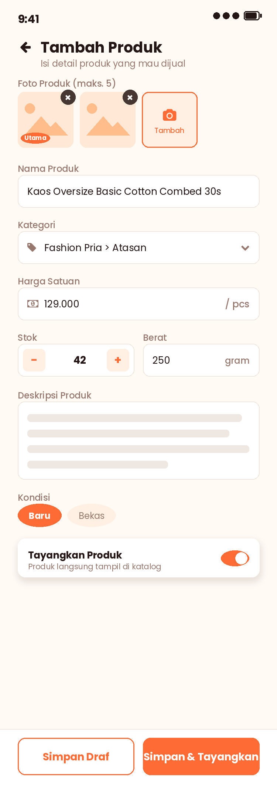

- [ ] Flutter: halaman **Atur Stok & Harga** (edit cepat massal + banner peringatan stok menipis)

  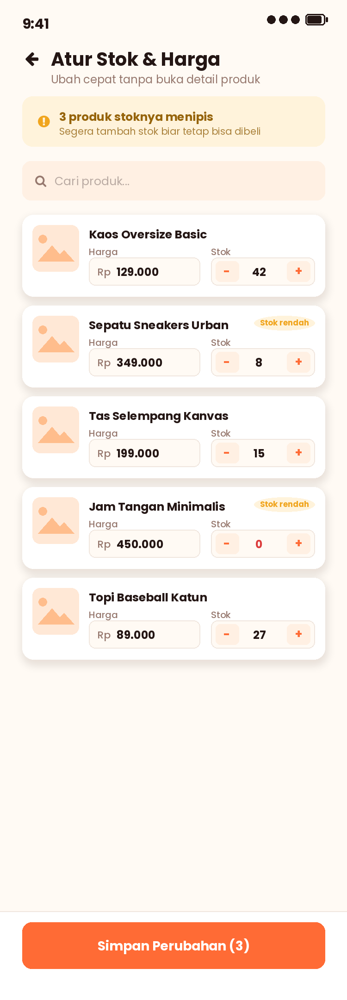

- [ ] Flutter: `productProvider` + `productFormProvider` (Riverpod) + `services/seller_product_api_service.dart`

## Fase 4 — Pesanan (SubOrder)

- [ ] Backend: **refactor checkout** — `POST /api/orders` mengelompokkan cart item per `StoreId`, membuat 1 `Order` + N `SubOrder`, menghitung ongkir & komisi per toko
- [ ] Backend: **kurangi stok** saat sub-order diterima penjual, dan kembalikan stok saat ditolak/dibatalkan 🐛 (sekarang stok tidak pernah berkurang sama sekali)
- [ ] Backend: `GET /api/seller/orders?status=&page=` (tab Baru/Diproses/Dikirim/Selesai/Batal) & `GET /api/seller/orders/{id}` (detail + pembeli + alamat + rincian komisi)
- [ ] Backend: `POST /api/seller/orders/{id}/accept` (Baru → Diproses), `POST /api/seller/orders/{id}/reject` (+ alasan, stok & dana dikembalikan), `POST /api/seller/orders/{id}/ship` (kurir + nomor resi + foto bukti opsional → Dikirim)
- [ ] Backend: job/pengecekan **auto-cancel** kalau penjual tidak konfirmasi sampai `AutoCancelAt`, dan **auto-complete** X hari setelah `Shipped`
- [ ] Backend: setiap transisi status memanggil `INotificationService` ke pembeli (reuse `NotifyOrderStatusChangedAsync`, sesuaikan supaya berbasis sub-order)
- [ ] Backend: batasi `PATCH /api/orders/{id}/status` versi pembeli — hanya boleh `Cancelled` (sebelum diproses) dan `Completed` (terima barang); perubahan status lain jadi wewenang seller ⚠️ ini mengubah perilaku yang dicatat di TASKS.md Fase 4
- [ ] Backend: ongkir per kurir & berat (menggantikan `FlatShippingCost = 15000`) — minimal tabel tarif statis dulu, integrasi API kurir (RajaOngkir/Biteship) menyusul
- [ ] Flutter: halaman **Daftar Pesanan** (tab status, countdown batas konfirmasi, tombol Tolak/Proses, tombol Input Resi)

  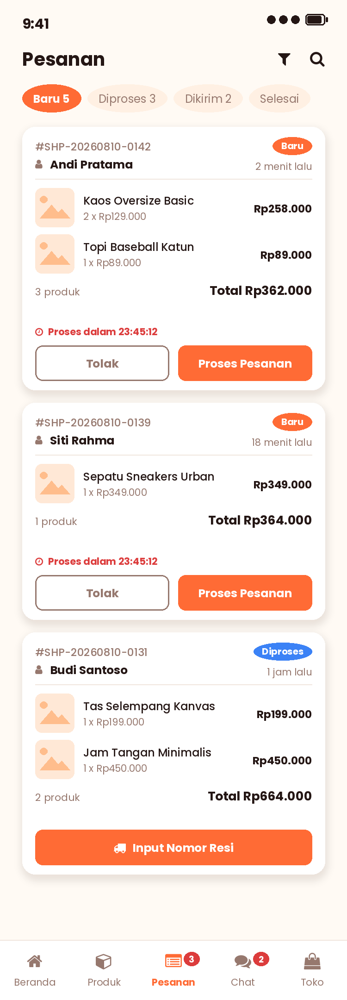

- [ ] Flutter: halaman **Detail Pesanan** (banner status + countdown, kartu pembeli + tombol chat, alamat & kurir, daftar produk, rincian pembayaran + potongan komisi + estimasi masuk saldo, catatan pembeli)

  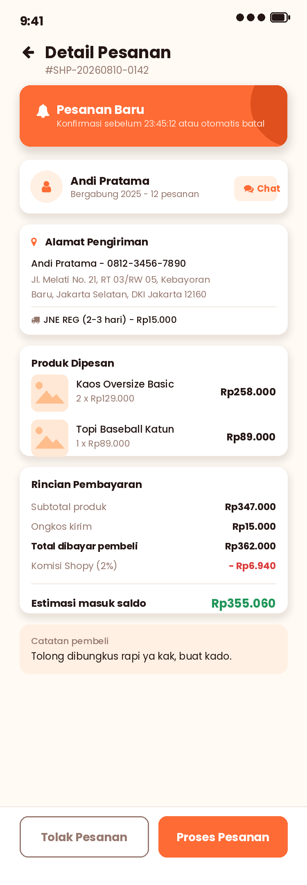

- [ ] Flutter: halaman **Kirim Pesanan** (pilih kurir, input/scan nomor resi, foto bukti serah terima, konfirmasi)

  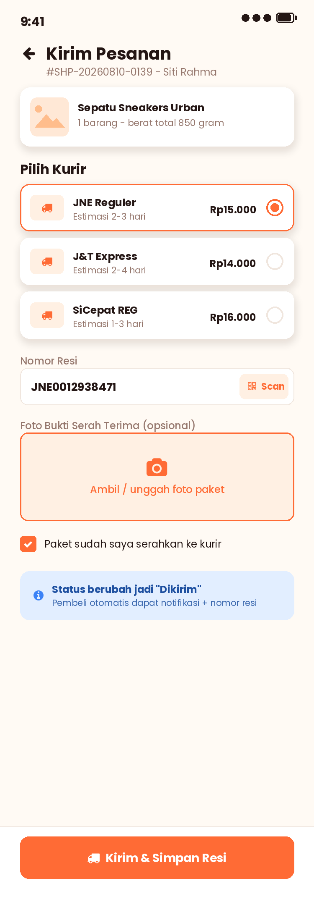

- ⚠️ Perubahan di app pembeli: Keranjang dikelompokkan per toko, Checkout menampilkan ongkir per toko, Riwayat & Detail Pesanan dipecah per toko, dan timeline "Lacak Pesanan" dibaca dari `SubOrderStatusHistories`. Tombol "Lacak Paket" bisa diisi nomor resi asli dari seller.

## Fase 5 — Keuangan & Pencairan

- [ ] Backend: pembentukan saldo otomatis — saat sub-order `Completed`: catat `BalanceTransactions` `SaleIncome` (+) dan `Commission` (−), pindahkan dari `PendingBalance` ke `AvailableBalance`
- [ ] Backend: escrow — dana masuk `PendingBalance` saat pembayaran `Settled` (hook di `PaymentsController`/webhook Midtrans yang sudah ada), baru cair setelah pesanan selesai
- [ ] Backend: `GET /api/seller/balance` (saldo tersedia, tertahan, total penghasilan), `GET /api/seller/balance/transactions?type=&page=` (mutasi)
- [ ] Backend: `POST /api/seller/withdrawals` (validasi minimal, saldo cukup, rekening terverifikasi, batas per hari), `GET /api/seller/withdrawals`
- [ ] Backend: `GET /api/seller/reports/earnings?from=&to=` + ekspor CSV ("Unduh Laporan")
- [ ] Flutter: halaman **Keuangan** (kartu saldo, ringkasan penghasilan/komisi/pesanan selesai, filter mutasi, daftar mutasi saldo)

  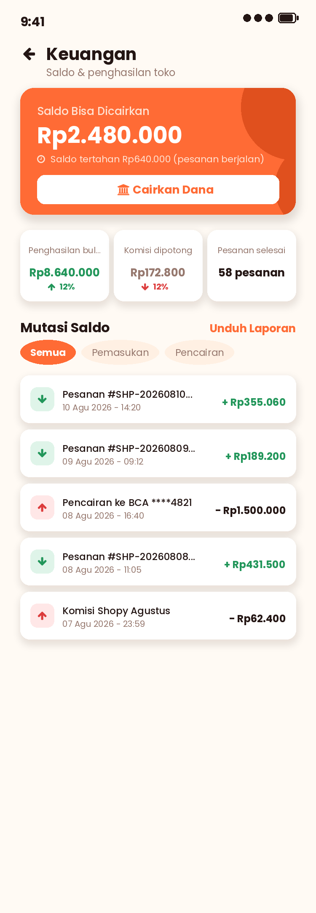

- [ ] Flutter: halaman **Pencairan Dana** (jumlah + cairkan semua, rekening tujuan, rincian biaya admin, info estimasi, riwayat pencairan)

  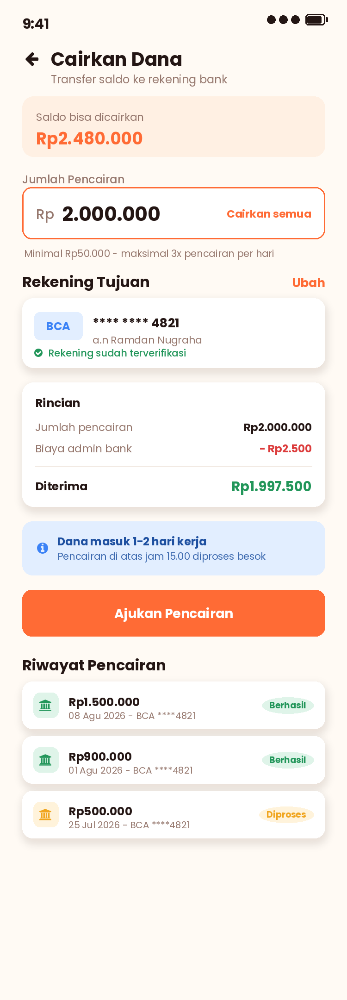

- ⚠️ Pencairan **beneran** ke rekening butuh layanan disbursement (Midtrans Iris / Xendit Disbursement) yang berbeda dari Core API pembayaran yang sudah dipakai. Untuk sekarang cukup sampai status `Pending`/`Processing` yang diproses manual oleh admin (Fase 9), sama polanya seperti `Midtrans:ServerKey` yang masih kosong di TASKS.md Fase 5.

## Fase 6 — Promo & Voucher Toko

- [ ] Backend: CRUD voucher toko `GET/POST/PUT/DELETE /api/seller/vouchers` + `PATCH .../active`
- [ ] Backend: validasi & penerapan voucher di checkout (`POST /api/vouchers/validate` untuk app pembeli) — cek kuota, periode, minimal belanja, 1 voucher per toko per transaksi, catat ke `VoucherUsages`
- [ ] Backend: diskon produk (harga coret) — `PATCH /api/seller/products/{id}/discount` mengisi `DiscountPrice` + periode; DTO produk publik mengembalikan harga asli & harga diskon
- [ ] Backend: flash sale terjadwal (opsional) — `FlashSales`/`FlashSaleItems` + endpoint publik "sedang berlangsung"
- [ ] Backend: statistik pemakaian voucher (dipakai berapa kali, omzet yang dihasilkan)
- [ ] Flutter: halaman **Promo & Voucher** (tab Voucher Toko / Diskon Produk / Flash Sale, kartu voucher + progress kuota, aktif/nonaktifkan, buat voucher baru)

  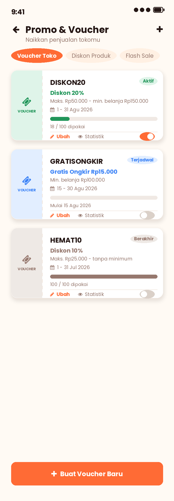

- [ ] Flutter: form Buat/Ubah Voucher (kode, tipe, nilai, maksimal diskon, minimal belanja, kuota, periode)
- ⚠️ Perubahan di app pembeli: kode promo masih di-hardcode di Flutter (`kMockPromoCode = 'HEMAT20'` di `providers/cart_provider.dart`, dipakai `widgets/cart/promo_code_section.dart`) — ganti dengan panggilan ke endpoint validasi voucher. Kartu produk & Detail Produk perlu menampilkan harga coret (TASKS.md Fase 2 sudah mencatat ini sebagai bagian mockup yang dilewati karena field diskon belum ada).

## Fase 7 — Chat & Ulasan

- [ ] Backend: `GET /api/seller/chats` (daftar room + unread), `GET /api/seller/chats/{roomId}/messages?before=`, `POST /api/seller/chats/{roomId}/messages`, `POST /api/seller/chats/{roomId}/read`
- [ ] Backend: sisi pembeli `POST /api/chats` (buka/ambil room dengan toko tertentu) + endpoint kembar untuk kirim/baca pesan
- [ ] Backend: lampiran pesan berupa produk atau pesanan (`ProductId`/`SubOrderId` di `ChatMessages`)
- [ ] Backend: realtime dengan **SignalR** (`/hubs/chat`) — kalau terlalu berat, fallback ke polling 5 detik + push FCM untuk pesan baru ⚠️ belum ada infrastruktur realtime sama sekali di project ini
- [ ] Backend: **ReviewsController** (belum ada sama sekali) — `GET /api/products/{id}/reviews` (publik), `POST /api/orders/{subOrderId}/reviews` (pembeli, hanya untuk pesanan `Completed` miliknya), hitung ulang `Product.RatingAverage`/`RatingCount` & `Store.RatingAverage`
- [ ] Backend: `GET /api/seller/reviews?filter=belum-dibalas|rating` + `POST /api/seller/reviews/{id}/reply` (balasan penjual)
- [ ] Flutter: halaman **Daftar Chat** + **Ruang Chat** (konteks produk, gelembung pesan, status terkirim/dibaca, balasan cepat, lampiran gambar/produk)

  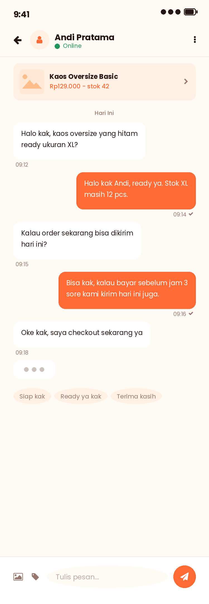

- [ ] Flutter: halaman **Ulasan Produk** (ringkasan rating + distribusi bintang, filter belum dibalas, kartu ulasan, form balasan)

  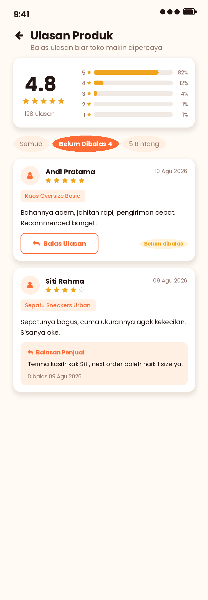

- ⚠️ Perubahan di app pembeli: tombol **"Hubungi Penjual"** di `order_detail_screen.dart` masih placeholder — sambungkan ke chat. Halaman Detail Produk perlu daftar ulasan per orang (sekarang cuma agregat `RatingAverage`/`RatingCount`, seperti dicatat di TASKS.md Fase 2), dan perlu alur "Beri Ulasan" setelah pesanan selesai.

## Fase 8 — Dashboard, Statistik & Notifikasi

- [ ] Backend: `GET /api/seller/dashboard` — saldo, pesanan baru, produk terjual hari ini, pengunjung toko, penghasilan, daftar "perlu ditindaklanjuti" (pesanan baru, siap dikirim, stok menipis, ulasan belum dibalas), grafik 7 hari
- [ ] Backend: `GET /api/seller/statistics?period=7d|30d|90d` — omzet, jumlah pesanan, produk terjual, rata-rata order, omzet harian, produk terlaris (+ perbandingan periode sebelumnya)
- [ ] Backend: hitung `ViewCount` produk (increment di endpoint detail produk publik) untuk metrik "Pengunjung Toko"
- [ ] Backend: perluas `NotificationType` — `NewOrder`, `PaymentReceived`, `LowStock`, `NewReview`, `NewChat`, `Withdrawal`, `VoucherQuota` — dan tambah `Notification.StoreId` supaya notifikasi seller terpisah dari notifikasi pembeli
- [ ] Backend: kirim push ke device seller — reuse `PushNotificationService` + tabel `DeviceTokens`, tambah kolom penanda app (`AppType`: `Buyer`/`Seller`) supaya token tidak tertukar
- [ ] Flutter: halaman **Dashboard/Beranda** (kartu saldo, ringkasan hari ini, perlu ditindaklanjuti, grafik penjualan 7 hari, bottom nav 5 tab)

  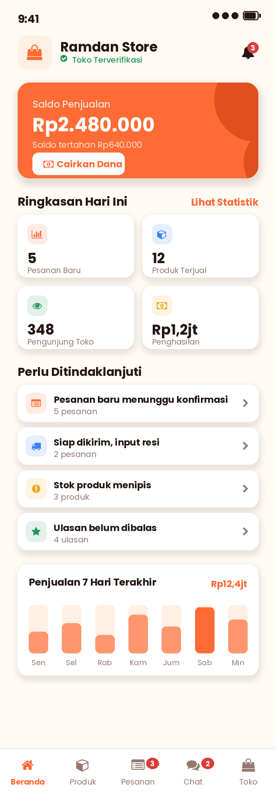

- [ ] Flutter: halaman **Statistik Penjualan** (filter periode, kartu metrik + delta, grafik omzet harian, produk terlaris)

  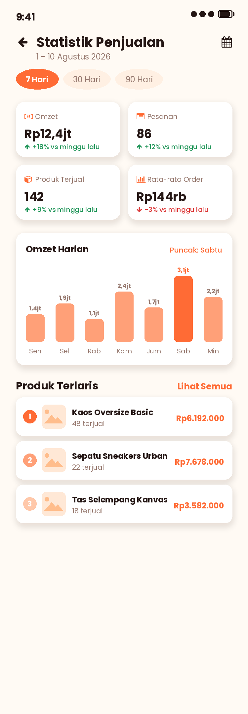

- [ ] Flutter: halaman **Notifikasi Seller** (kelompok Hari Ini/Kemarin, penanda belum dibaca, filter kategori, tandai semua dibaca)

  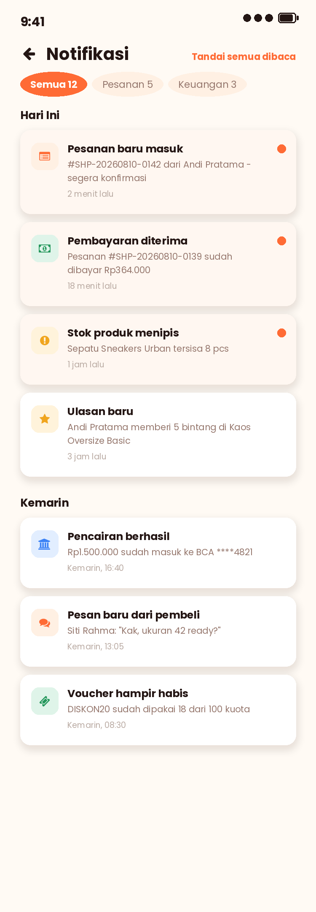

- [ ] Flutter: banner notifikasi foreground (reuse pola `in_app_notification_banner.dart` + `notification_banner_host.dart` dari app pembeli)
- ⚠️ Firebase masih placeholder: `shopy-mobile/lib/firebase_options.dart` isinya `REPLACE_ME` dan `Firebase:ServiceAccountKeyPath` di backend masih kosong. App seller perlu didaftarkan sebagai **aplikasi kedua** di project Firebase yang sama (`flutterfire configure` di folder `shopy-seller`) sebelum push bisa diuji.

## Fase 9 — Admin & Moderasi (minimal)

- [ ] Backend: `[Authorize(Roles = "Admin")]` — verifikasi toko (approve/reject + alasan), suspend/aktifkan toko
- [ ] Backend: proses pencairan (`PATCH /api/admin/withdrawals/{id}` → `Processing`/`Completed`/`Rejected`)
- [ ] Backend: moderasi produk & ulasan (takedown produk bermasalah)
- [ ] Backend: **kunci `POST /api/notifications/promo` ke role Admin** — sekarang bisa dipanggil user manapun yang login ⚠️
- [ ] Backend: pengaturan platform (persentase komisi, biaya admin, ambang stok menipis)
- [ ] Untuk tahap awal cukup lewat Swagger + akun admin yang di-seed; dashboard admin (web) di luar cakupan dokumen ini

## Fase 10 — Polish & Testing

- [ ] Review & rapikan UI/UX semua halaman seller (bandingkan dengan mockup)
- [ ] Unit test backend: pemecahan sub-order, perhitungan komisi & saldo, validasi voucher, transisi status pesanan
- [ ] Widget/integration test Flutter seller
- [ ] Testing manual end-to-end: buka toko → verifikasi → tambah produk → pembeli checkout → seller terima → kirim resi → pembeli selesaikan → saldo masuk → ajukan pencairan
- [ ] Uji lintas-app: pastikan app pembeli (`shopy-mobile`) tetap jalan setelah refactor `StoreId` & `SubOrders`
- [ ] Seed data demo seller untuk pengembangan (mirip `CatalogSeeder`)
- [ ] Perbaikan bug hasil testing

## Fase 11 — Rilis

- [ ] App icon & splash screen final app seller (bedakan dari app pembeli, mis. logo dengan aksen "Seller")
- [ ] Build release (Android APK/AAB, iOS jika perlu)
- [ ] Deploy backend versi baru + jalankan migration di server
- [ ] Submit ke Play Store sebagai aplikasi terpisah
- [ ] Dokumentasi akhir & update README (tambahkan `shopy-seller/` ke struktur proyek)

---

## Catatan Teknis

**Akun test (dari TASKS.md):**

```
test@shopy.com
Test1234!
```

**Struktur monorepo setelah Fase 0:**

```
shopy/
├── assets/                 # Logo & aset bersama
├── shopy-mobile/           # App Flutter pembeli (sudah ada)
├── shopy-seller/           # App Flutter penjual (baru)
│   ├── lib/
│   └── design/assets/      # Mockup UI seller
├── shopy-api/              # Backend .NET Core (dipakai bersama)
├── TASKS.md                # Tahap pengerjaan sisi pembeli
├── TASKSELLER.md           # Dokumen ini
└── README.md
```

**Urutan pengerjaan yang disarankan:** Fase 0 → 1 → 3 → 4 adalah jalur kritis (toko → role → produk → pesanan). Fase 5-8 bisa dikerjakan paralel setelah Fase 4 selesai. Fase 9 boleh menyusul belakangan karena bisa disiasati lewat Swagger.

**Mockup:** semua gambar di `shopy-seller/design/assets/` memakai gaya **Bold & Colorful** yang sama dengan app pembeli (primary `#FF6B35`, Poppins, kanvas 750×2160). Script generatornya ada di `shopy-seller/design/` (`mockup_lib.py`, `screens_a.py`, `screens_b.py`) kalau nanti perlu diubah.

---

**Cara pakai file ini:** centang `[ ]` jadi `[x]` setiap task selesai. Tulis catatan implementasi & peringatan (⚠️) di bawah task terkait, sama seperti gaya TASKS.md, supaya konteksnya tidak hilang.
